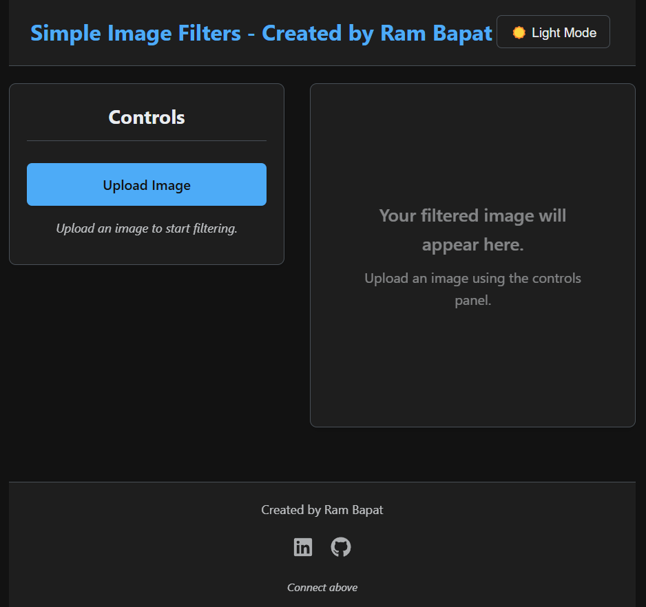
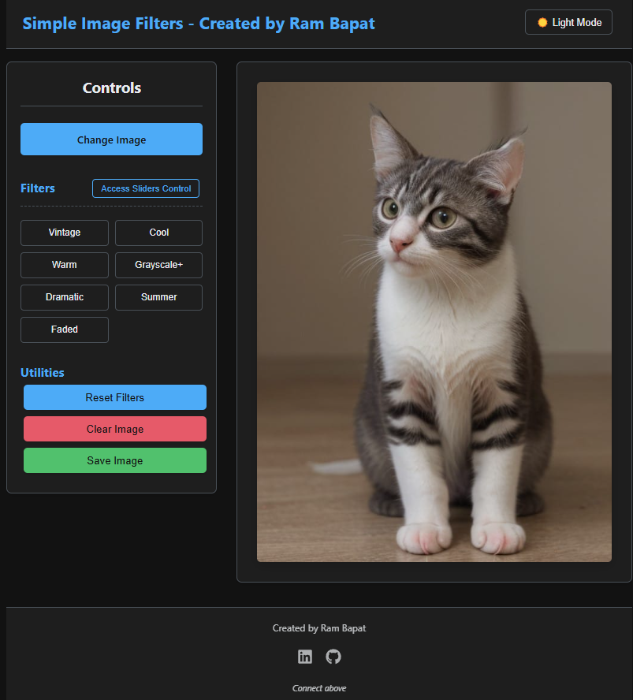
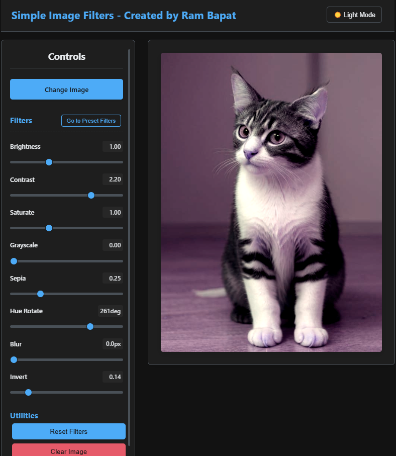

# Modern Dark-Theme Image Filter App (React) ✨🎨

## Try live demo - [Demo](https://modern-dark-theme-image-filter-app.vercel.app/)

A sleek, modern image filtering application built with React and Vite. Features include live previews, adjustable filter sliders, curated presets, dark/light theme toggling, and the ability to save your creations.

<!-- ================================================== -->
<!-- === Screenshots === -->




<!-- ================================================== -->

## Overview

This project provides a user-friendly web interface for applying visual filters to uploaded images. Users can easily:

*   Upload an image from their device.
*   Instantly see the effects of filters in a live preview viewport.
*   Choose between applying curated **Presets** (like "Vintage", "Cool", "Dramatic") or fine-tuning filters using individual **Sliders** (Brightness, Contrast, Saturate, Blur, etc.).
*   Toggle between the Preset and Slider control views.
*   Switch between a modern **Dark Theme** (default) and a clean Light Theme.
*   Utilize utility functions like Reset Filters, Clear Image, and **Save Filtered Image**.

The goal was to create a visually appealing and functional image editing tool.

## Features

*   **Image Upload:** Select local image files (`jpg`, `png`, `webp`, etc.).
*   **Live Filter Preview:** See filter changes applied instantly in the main viewport.
*   **Dual Filter Modes:**
    *   **Presets:** Apply predefined filter combinations with a single click.
    *   **Sliders:** Fine-tune individual CSS filters (`brightness`, `contrast`, `saturate`, `grayscale`, `sepia`, `hue-rotate`, `blur`, `invert`) with range inputs.
*   **Mode Toggle:** Easily switch between Preset buttons and Slider controls.
*   **Theme Switching:** Toggle between Dark (default) and Light UI themes, with smooth transitions. Theme preference can be optionally saved in `localStorage`.
*   **Utility Controls:** Buttons for "Reset Filters", "Clear Image", and "Save Image".
*   **Save Image Functionality:** Download the currently filtered image as a PNG file using the HTML Canvas API to accurately capture applied filters.
*   **Responsive Design:** Adapts layout for different screen sizes (desktop, tablet, mobile).
*   **Modern Tech Stack:** Built with React, Vite, and modern CSS.
*   **Iconography:** Uses `react-icons` for a cleaner UI in the footer and potentially buttons.

## Tech Stack

*   **Frontend:** React 18+
*   **Build Tool:** Vite
*   **Styling:** CSS3 (including Flexbox, Grid, Custom Properties/Variables)
*   **Language:** JavaScript (ES6+)
*   **Image Saving:** HTML Canvas API (2D Context `filter` property)
*   **Icons:** `react-icons`
*   **Package Manager:** npm

## Getting Started

To get a local copy up and running, follow these simple steps.

### Prerequisites

*   Node.js (which includes npm) installed on your system. You can download it from [nodejs.org](https://nodejs.org/).
*   Git (for cloning the repository).

### Installation & Setup

1.  **Clone the repository:**
    *(Replace with your actual repository URL)*
    ```bash
    git clone https://github.com/Barrsum/Modern-Dark-Theme-Image-Filter-App.git
    ```

2.  **Navigate to the project directory:**
    ```bash
    cd Modern-Dark-Theme-Image-Filter-App
    ```

3.  **Install NPM packages:**
    ```bash
    npm install
    ```
    *(This will install React, React Icons, and other necessary dependencies.)*

### Running the Project

1.  **Start the development server:**
    ```bash
    npm run dev
    ```
    This command will start the Vite development server.

2.  **Open the application:**
    Open your web browser and navigate to the local URL provided by Vite (usually `http://localhost:5173/` or a similar port).

## Contributing

Contributions, issues, and feature requests are welcome! As this was part of a daily challenge, it might not be actively maintained, but feel free to fork and experiment.

1.  Fork the Project
2.  Create your Feature Branch (`git checkout -b feature/AmazingFeature`)
3.  Commit your Changes (`git commit -m 'Add some AmazingFeature'`)
4.  Push to the Branch (`git push origin feature/AmazingFeature`)
5.  Open a Pull Request

## License

Distributed under the MIT License. See `LICENSE.md` for more information. (You may need to create a `LICENSE.md` file with the standard MIT license text).

## Acknowledgements

*   **React:** [react.dev](https://react.dev/)
*   **Vite:** [vitejs.dev](https://vitejs.dev/)
*   **React Icons:** [react-icons.github.io/react-icons/](https://react-icons.github.io/react-icons/)
*   **CSS Filters & Canvas API:** [MDN Web Docs](https://developer.mozilla.org/) for documentation and inspiration.

---

Built by Ram Bapat - [LinkedIn Profile](https://www.linkedin.com/in/ram-bapat-barrsum-diamos)
